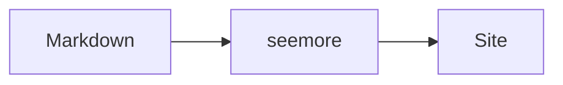

# Writing pages

seemore renders GitHub Flavoured Markdown in `.md` and `.mdx` files, plus the additions below. Read this before writing anything beyond prose.

## Page addresses

| File | Address |
| --- | --- |
| `index.md` | `/` |
| `README.md` (root) | `/` |
| `getting-started.md` | `/getting-started` |
| `guide/index.md` | `/guide` |
| `guide/Deep Dive.md` | `/guide/deep-dive` |

Both `/guide` and `/guide/` work on every host. In one directory `index.md` wins over `README.md`, with a warning naming the file it ignored. Two files slugifying to the same address is a build error naming both.

## Linking between pages

Prefer `[[wikilinks]]`:

```md
See [[getting-started]], or [[guide/writing|how to write pages]], or [[configuration#Search]].
```

They take a page name, not a relative path, so they survive a file moving. Relative `.md` links also work and resolve automatically, so existing content doesn't need converting.

Dead links are a warning in the preview and a build failure — that's the point: the build is where you find them.

## Admonitions

```md
> [!NOTE]
> Worth knowing.

> [!TIP]
> A better way to do it.

> [!WARNING]
> This will surprise you.
```

In `.mdx`, `<Callout type="warn" title="Careful">…</Callout>` is the same box with an explicit title. `type` is `info`, `warn`, `error`, `success` or `idea`.

## Steps

Numbered headings become a drawn, numbered sequence, rule and markers added for you:

```md
## 1. Install it

## 2. Point it at a folder
```

Use for anything procedural — reads far better than a bare ordered list.

## Code blocks

Highlighted at build time by Shiki, in the theme's colours. Settings go on the fence line, after the language:

````md
```ts title="server.ts" lineNumbers
const port = 4040;
```
````

| On the fence | Effect |
| --- | --- |
| `title="server.ts"` | Filename bar above the block |
| `lineNumbers` | Numbers down the side; `lineNumbers=5` starts at 5 |
| `noCopy` | No copy button on this one block |

Line markers are comments in the code's own comment syntax, and never reach the page:

```ts
const marked = 1; // [!code highlight]
const added = 2; // [!code ++]
const removed = 3; // [!code --]
const focused = 4; // [!code focus]
const found = 'needle'; // [!code word:needle]
```

So `# [!code highlight]` in Python, `<!-- [!code highlight] -->` in HTML.

## Diagrams

Mermaid and D2, straight from a fence, no setup, rendered in the browser:

````md

````

````md
```d2
markdown -> seemore -> site
```
````

Reach for one when the content is genuinely a graph or sequence — three boxes in a row is worse than the sentence it replaces.

## Images and PDFs

Drop the file next to the page and link it relatively. Images are inlined as hashed assets with click-to-zoom; PDFs open in the browser's own viewer.

```md


[The spec](./spec.pdf)
```

Always write real alt text describing what's in the image — it's what a screen reader and a search index get.

## Components

An `.mdx` file can use these six without importing anything. **There are no others.** Any other tag fails the build, naming the file and the component (fumadocs' `<Tabs>`, `<Accordions>` and `<Files>` included).

| Component | What it is |
| --- | --- |
| `<Callout type="warn" title="…">` | The box `> [!WARNING]` produces |
| `<Card>`, `<Cards>` | The link cards the generated index is built from |
| `<CodeBlockTabs>` | One code block per tab: npm, pnpm, yarn, bun |
| `<Mermaid>`, `<D2>` | What a diagram fence compiles to; usable directly |
| `<Pdf>` | The viewer a linked PDF opens in |

In a plain `.md` file a tag isn't JSX at all: it's dropped and its text kept. So components need the `.mdx` extension — if a user's `<Callout>` "isn't working", check the extension first.

Code tabs need a `defaultValue`, or the block opens with nothing selected. Leave a blank line around each fence:

````mdx
<CodeBlockTabs defaultValue="npm">
  <CodeBlockTabsList>
    <CodeBlockTabsTrigger value="npm">npm</CodeBlockTabsTrigger>
    <CodeBlockTabsTrigger value="pnpm">pnpm</CodeBlockTabsTrigger>
  </CodeBlockTabsList>
  <CodeBlockTab value="npm">

```bash
npm i seemore
```

  </CodeBlockTab>
  <CodeBlockTab value="pnpm">

```bash
pnpm add seemore
```

  </CodeBlockTab>
</CodeBlockTabs>
````

## Editing someone else's content

Two rules — getting these wrong is how you lose a user's trust:

- **Change what was asked and nothing else.** Don't reflow paragraphs, re-wrap lines, normalise quotes or "tidy" headings in a file you were asked to fix one sentence in. The diff should be readable.
- **Keep their voice.** If their docs are terse and lowercase, write terse and lowercase.

When restructuring is genuinely needed (splitting a 3,000-line file), describe the split and get a yes before moving text.

## A style that suits docs

- Lead with what the reader wants to do; put background after, or leave it out.
- One idea per section, with a heading that says what the section is about.
- Show the command or code, then explain it — a reader scanning for the snippet should find it without reading the prose.
- Prefer a table over a bulleted list of key–value pairs.
- Write the page someone would want at the moment they're stuck.
